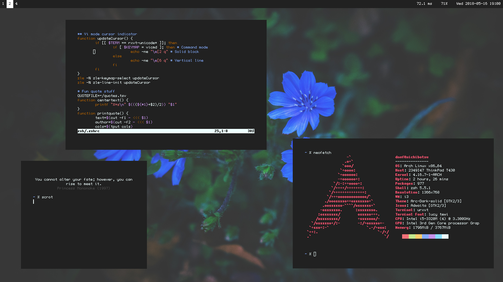

# dotfiles

## Dependencies

### Neovim

- Remote plugins for Python, Ruby, and Lua are required.
- `https://github.com/nsf/gocode` is required for Go completion
- `deoplete-go` may need to be manually built after running `:PluginInstall`. Go to `~/.vim/bundle/deoplete-go` and run `make`.
